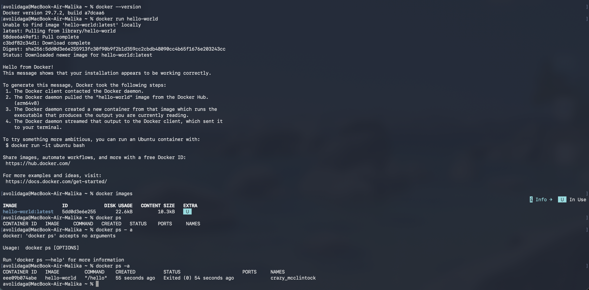
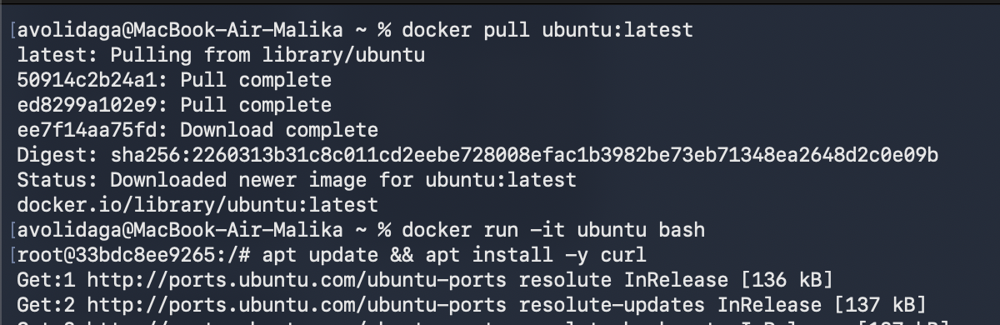
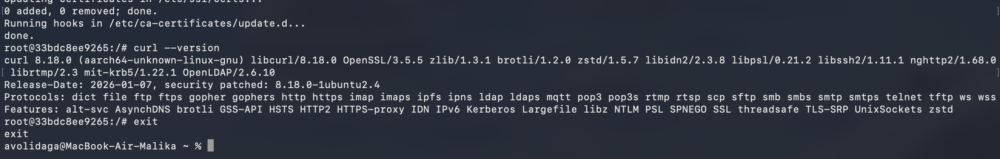
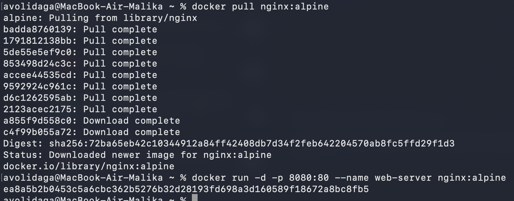
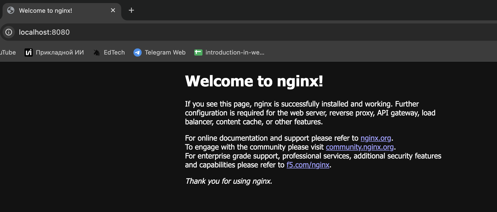
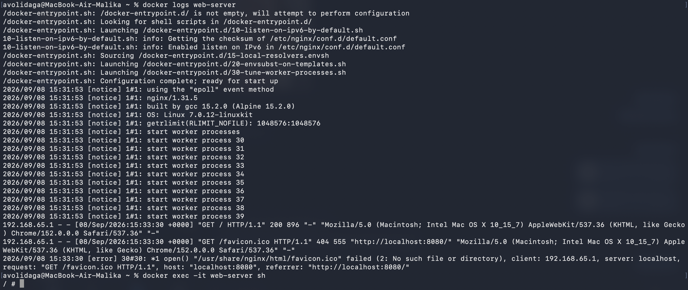
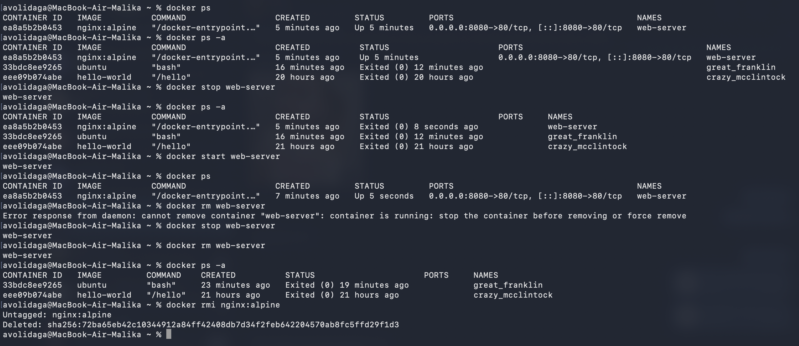
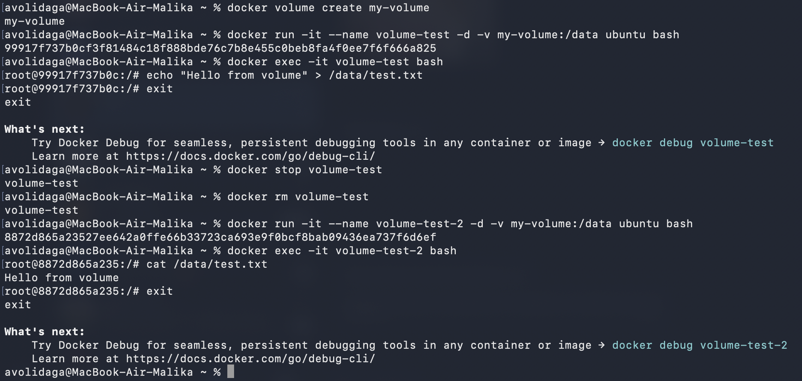

University: [ITMO University](https://itmo.ru/ru/) 
Faculty: [FICT](https://fict.itmo.ru) 
Course: [Введение в веб технологии](https://itmo-ict-faculty.github.io/introduction-in-web-tech/) 
Year: 2026/2027 
Group: U4225 
Author: Agadilova Malika 
Lab: Lab1 
Date of create: 06.09.2026 
Date of finished: -
# Лабораторная работа №1. Основы работы с Docker
## Цель работы

Научиться работать с Docker: устанавливать Docker, создавать Dockerfile, собирать образы, запускать контейнеры и управлять ими.

## Ход работы

### 1. Установка и проверка Docker

#### Задание
1. Установить Docker Desktop (для Windows/Mac) или Docker Engine (для Linux)
2. Проверить установку командой docker --version
3. Запустить тестовый контейнер: docker run hello-world
4. Изучить базовые команды: docker images, docker ps, docker ps -a
#### Выполнение

- `docker images` - используется для вывода списка всех локальных образов, которые присутствуют компьютере

- `docker ps` - используется для вывода списка запущенных контейнеров в данный момент

- `docker ps -a` - показывает в том числе и остановленные контейнеры

### 2. Работа с образом Ubuntu

#### Задание
1. Скачать образ Ubuntu: `docker pull ubuntu:latest`
2. Запустить интерактивный контейнер: `docker run -it ubuntu bash`
3. Внутри контейнера установить пакет (например, curl): `apt update && apt install -y curl`
4. Проверить установку: `curl --version`
5. Выйти из контейнера: `exit`

#### Выполнение
Запуск Ubuntu и скачивание curl

Проверка установки curl и выход из контейнера

### 3. Запуск веб-сервера nginx

#### Задание
1. Запустить контейнер с nginx: `docker run -d -p 8080:80 --name web-server nginx:alpine`
2. Проверить работу в браузере: http://localhost:8080
3. Посмотреть логи контейнера: `docker logs web-server`
4. Подключиться к контейнеру: `docker exec -it web-server sh`

#### Выполнение
Скачивание nginx и запуск web-сервера

Проверка запуска web-сервера

Просмотр логов и подключение к контейнеру

### 4. Управление контейнерами

#### Задание
1. Посмотреть запущенные контейнеры: `docker ps`
2. Посмотреть все контейнеры: `docker ps -a`
3. Остановить контейнер: `docker stop web-server`
4. Запустить остановленный контейнер: `docker start web-server`
5. Удалить контейнер: `docker rm web-server`
6. Удалить образ: `docker rmi nginx:alpine`

#### Выполнение
Все пункты из задания выполнялись последовательно, параллельно проверяя пункты 3-5 с помощью команды `docker ps`. Оказалось, что нельзя удалить контейнер, пока он запущен.

### 5. Работа с томами Docker

#### Задание
1. Создать том: `docker volume create my-volume`
2. Запустить контейнер с томом: `docker run -it --name volume-test -d -v my-volume:/data ubuntu bash`
3. Подключиться к контейнеру: `docker exec -it volume-test bash`
4. Создать файл в томе: `echo "Hello from volume" > /data/test.txt`
5. Удалить контейнер и создать новый с тем же томом
6. Проверить, что файл сохранился

#### Выполнение
Все пункты из задания выполнялись последовательно. 

Пункт 5 выполнялся через последовательность команд
1. `docker stop volume-test `
2. `docker rm volume-test` - так как удалить контейнер можно только после остановки
3. `docker run -it --name volume-test-2 -d -v my-volume:/data ubuntu bash` (для уверенности название контейнера был немного изменен)

Пункт 6
1. Подключение к новому контейнеру с тем же томом - `docker exec -it volume-test-2 bash`
2. Вывод строки "Hello from volume" с помощью команды `cat` из того же файла `/data/test.txt`. Если бы выполнили что-то не так в предыдущих пунктах, то при создании нового контейнера файла бы не было и команда `cat /data/test.txt` вывела бы ошибку `cat: /data/test.txt: No such file or directory.`

## Вывод

В ходе лабораторной работы были изучены основные принципы работы Docker. Был установлен и проверен Docker Desktop, выполнена работа с готовыми образами Ubuntu и nginx, изучены команды запуска, остановки и удаления контейнеров. Также была изучена работа с Docker volumes и подтверждено сохранение данных после удаления контейнера.