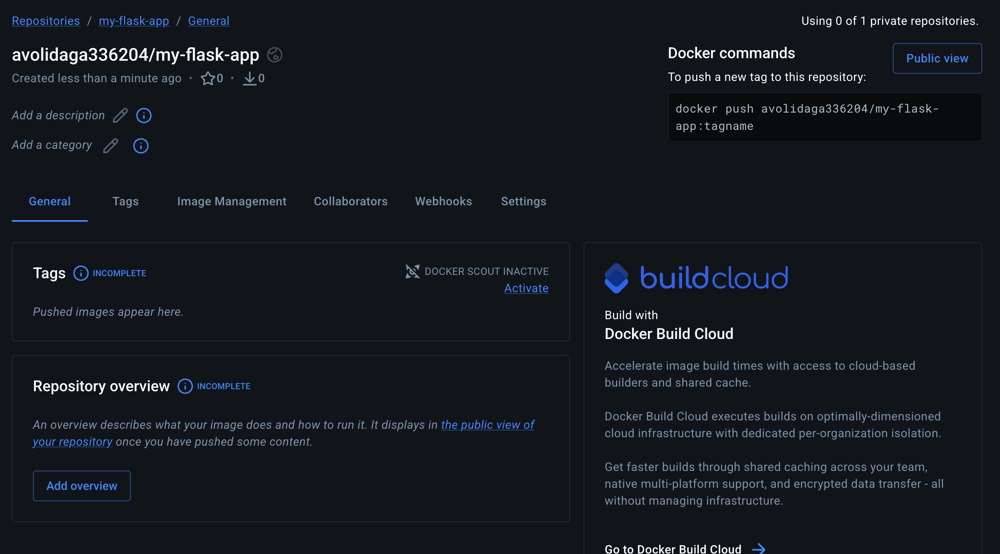
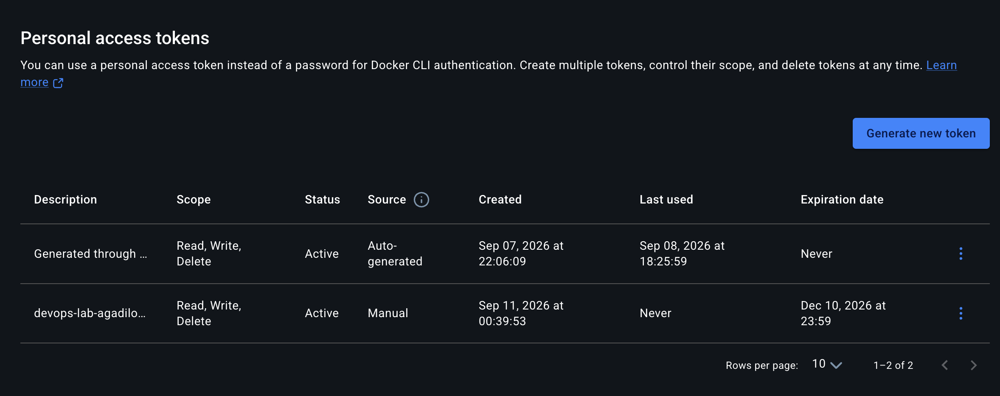
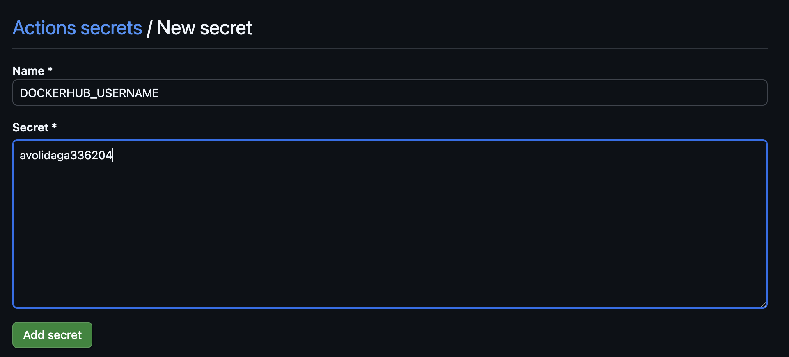
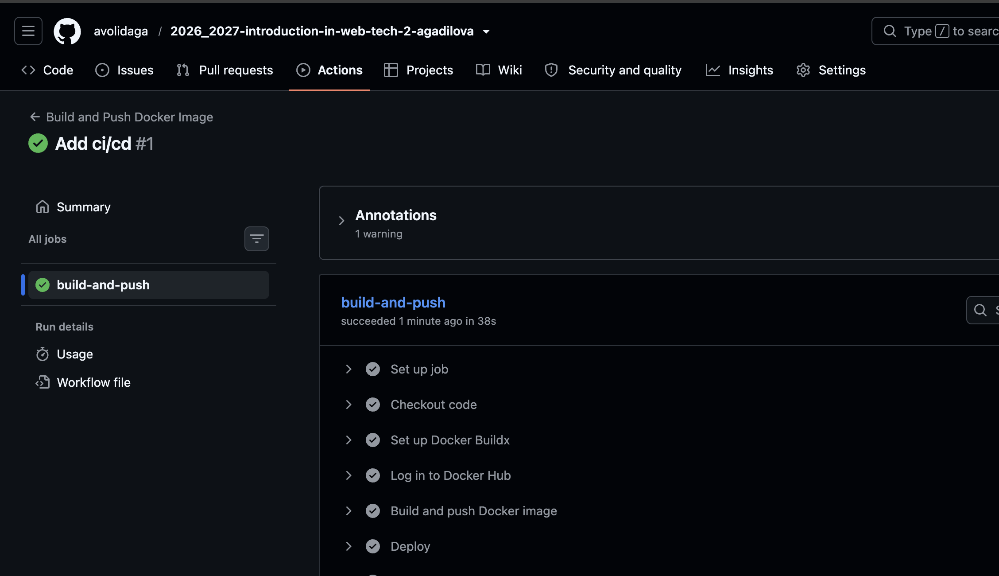
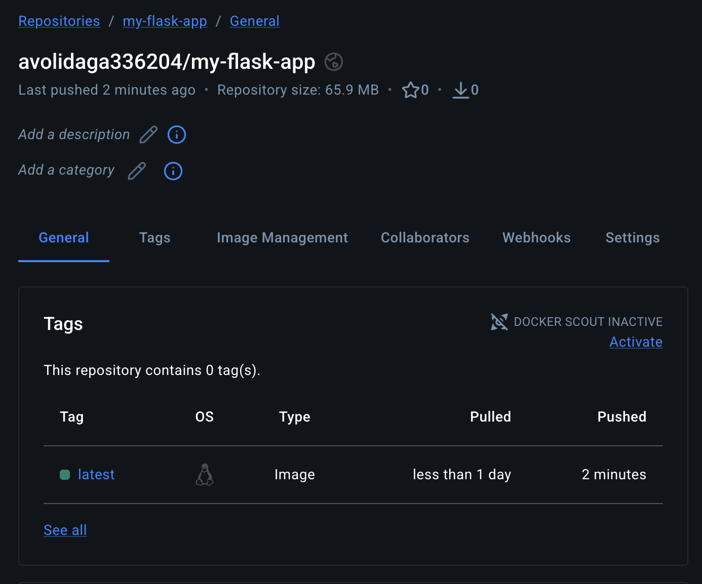

University: [ITMO University](https://itmo.ru/ru/)<br>
Faculty: [FICT](https://fict.itmo.ru)<br>
Course: [Введение в веб технологии](https://itmo-ict-faculty.github.io/introduction-in-web-tech/)<br>
Year: 2026/2027<br>
Group: U4225<br>
Author: Agadilova Malika<br>
Lab: Lab1<br>
Date of create: 06.09.2026<br>
Date of finished: -
# Лабораторная работа №2. CI/CD для Docker приложения
## Цель работы

Научиться настраивать автоматизированные пайплайны для сборки Docker образов, их публикации в registry и автоматического деплоя при изменении кода.


## Ход работы

### 1. Подготовка проекта

#### Задание
1. Скопировать файлы из первой лабораторной (app.py, requirements.txt, Dockerfile) в новый репозиторий
2. Создать аккаунт на Docker Hub (если нет)
3. Создать новый репозиторий на Docker Hub для вашего образа

#### Выполнение
Так как в прошлой лабораторной работе я не выполняла задание со '*', то уже для этой лабораторной создала файлы `app.py`, `requirements.txt`, `Dockerfile` с требованиями из прошлой лабораторной. Файлы расположены в репозитории [2026_2027-introduction-in-web-tech-2-agadilova](https://github.com/avolidaga/2026_2027-introduction-in-web-tech-2-agadilova.git)

Аккаунт на Docker HUB у меня уже был, только создала новый репозиторий для образа


### 2. Настройка GitHub Actions

#### Задание
1. Создать папку .github/workflows/ в корне проекта
2. Создать файл docker-build.yml с пайплайном, который должен:
    - Запускаться при пуше в main ветку
    - Использовать Ubuntu как runner
    - Выполнять checkout кода
    - Настраивать Docker Buildx
    - Логиниться в Docker Hub используя секреты
    - Собирать и пушить образ с тегом username/my-flask-app:latest
    - Добавлять шаг деплоя (можно просто echo сообщение)

#### Выполнение
В репозитории [2026_2027-introduction-in-web-tech-2-agadilova](https://github.com/avolidaga/2026_2027-introduction-in-web-tech-2-agadilova.git) в корне репозитория создала файл docker-build.yml

Запуск пайплайна при пуше в мейн
```
on:
  push:
    branches:
      - main
```
Используется Ubuntu в качестве ранера
```
runs-on: ubuntu-latest
```

Используется чекаут кода
```
      - name: Checkout code
        uses: actions/checkout@v4
```
Используется Docker Buildx
```
      - name: Set up Docker Buildx
        uses: docker/setup-buildx-action@v3
```
Логинится в Docker используя секреты
```
      - name: Log in to Docker Hub
        uses: docker/login-action@v3
        with:
          username: ${{ secrets.DOCKERHUB_USERNAME }}
          password: ${{ secrets.DOCKERHUB_TOKEN }}
```
Пушит образ в удаленный репозиторий
```
      - name: Build and push Docker image
        uses: docker/build-push-action@v6
        with:
          context: .
          file: ./Dockerfile
          push: true
          tags: ${{ secrets.DOCKERHUB_USERNAME }}/my-flask-app:latest
```
Отдельный шаг деплоя с заглушкой
```
      - name: Deploy
        run: echo "Deploying avolidaga336204/my-flask-app:latest"
```

### 3. Настройка секретов

#### Задание
В настройках GitHub репозитория добавить секреты:
- `DOCKER_USERNAME` - ваш логин на Docker Hub
- `DOCKER_PASSWORD` - ваш пароль или токен доступа Docker Hub


#### Выполнение
Получила personal-access-token в Docker HUB (devops-labs-agadilova)


После чего добавила оба секрета с именем и паролем (pat) от Docker HUB в репозиторий через его настройки


### 4. Тестирование пайплайна

#### Задание
1. Сделать коммит и пуш в main ветку
2. Проверить выполнение пайплайна в разделе Actions
3. Убедиться, что образ появился в Docker Hub
4. Проверить логи выполнения каждого шага

#### Выполнение
После пуша [коммита](https://github.com/avolidaga/2026_2027-introduction-in-web-tech-2-agadilova/commit/8ebb45b79a754d9e8e783e1338b61792485b4aac) в удаленный репозиторий, action успешно запустился и так же успешно завершился.


После этого я проверила, появился ли образ в репозиотрии docker. Как видно из скриншота все успешно залилось в Docker Hub.


При проверке логов, увидела несоклько интересных моментов:
1. На этапе чекаута появился лог об использовании старой версии Node
```
Node 20 is being deprecated. This workflow is running with Node 24 by default. If you need to temporarily use Node 20, you can set the ACTIONS_ALLOW_USE_UNSECURE_NODE_VERSION=true environment variable. For more information see: https://github.blog/changelog/2025-09-19-deprecation-of-node-20-on-github-actions-runners/
```
2. Так же на этапе Docker Buildx тоже было предупреждение об использовании deprecated модуля
```
DeprecationWarning: The `punycode` module is deprecated. Please use a userland alternative instead.
```
3. Полный ран пайплайна занял 38s

## Вывод

После выполнения git push в ветку main GitHub Actions автоматически собирает Docker-образ и публикует его в Docker Hub как kukhi/my-flask-app:latest.
Workflow был успешно выполнен со статусом Success.