University: [ITMO University](https://itmo.ru/ru/)<br>
Faculty: [FICT](https://fict.itmo.ru)<br>
Course: [Введение в веб технологии](https://itmo-ict-faculty.github.io/introduction-in-web-tech/)<br>
Year: 2026/2027<br>
Group: U4225<br>
Author: Agadilova Malika<br>
Lab: Lab3<br>
Date of create: 11.09.2026<br>
Date of finished: -
# Лабораторная работа №3. Мониторинг с Prometheus и Grafana
## Цель работы

Научиться настраивать локальную систему мониторинга, собирать метрики с помощью Prometheus и создавать дашборды в Grafana для визуализации данных.

## Ход работы

### 1. Создание конфигурации Prometheus:

#### Задание
1. Создать папку `prometheus` для конфигурации
2. Создать файл `prometheus/prometheus.yml` со следующим содержимым: 
```
global: scrape_interval: 15s

scrape_configs:
  - job_name: 'prometheus'
  static_configs:
  - targets: ['localhost:9090']

  - job_name: 'node-exporter'
  static_configs:
  - targets: ['node-exporter:9100']
```

#### Выполнение
Папка и файл были успешно созданы. В yaml конфигурации была исправлены табуляция для корректной работы:
```
global:
  scrape_interval: 15s

scrape_configs:
  - job_name: 'prometheus'
    static_configs:
      - targets: ['localhost:9090']

  - job_name: 'node-exporter'
    static_configs:
      - targets: ['node-exporter:9100']
```

### 2. Запуск Node Exporter

#### Задание
1. Запустить контейнер Node Exporter для сбора системных метрик
2. Проверить работу: `curl http://localhost:9100/metrics`

#### Выполнение
Node Exporter был запущен командой:
```
docker run -d \
      --name node-exporter \
      --restart=unless-stopped \
      -p 9100:9100 \
      -v "/proc:/host/proc:ro" \
      -v "/sys:/host/sys:ro" \
      -v "/:/rootfs:ro" \
      prom/node-exporter \
      --path.procfs=/host/proc \
      --path.rootfs=/rootfs \
      --path.sysfs=/host/sys \
      --collector.filesystem.mount-points-exclude="^/(sys|proc|dev|host|etc)($$|/)"

```

Пинг экспортера дал ответ:
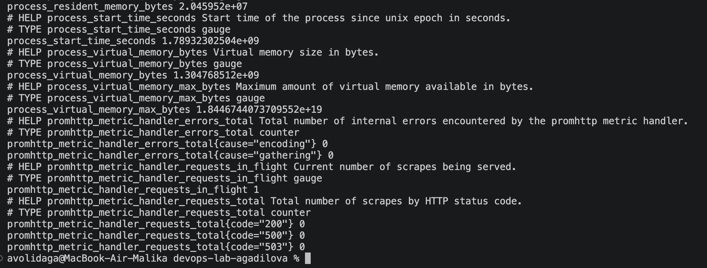

### 3. Запуск Prometheus

#### Задание
1. Создать том для данных Prometheus
2. Создать для них сеть
3. Запустить контейнер Prometheus
4. Проверить работу: открыть `http://localhost:9090` в браузере


#### Выполнение
1. Создан том для Prometheus
```
docker volume create prometheus-data
```
2. Создана общая сеть
```
docker network create monitoring
```
3. Запущен контейнер Prometheus
```
docker run -d \
      --name prometheus \
      --network monitoring \
      --restart=unless-stopped \
      -p 9090:9090 \
      -v prometheus-data:/prometheus \
      -v $(pwd)/prometheus:/etc/prometheus \
      prom/prometheus \
      --config.file=/etc/prometheus/prometheus.yml \
      --storage.tsdb.path=/prometheus \
      --web.console.libraries=/etc/prometheus/console_libraries \
      --web.console.templates=/etc/prometheus/consoles \
      --storage.tsdb.retention.time=200h \
      --web.enable-lifecycle
```
4. Проверена работа через админ-панель
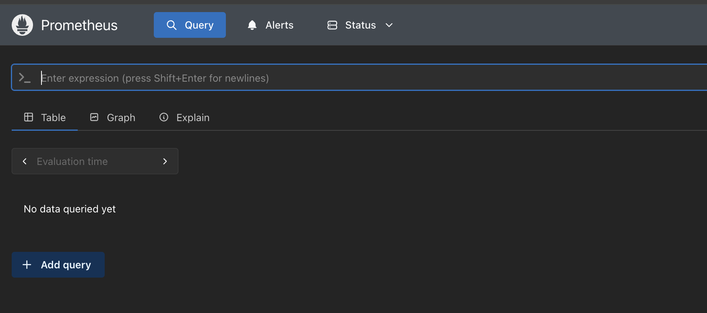

### 4. Запуск Grafana

#### Задание
1. Создать том для данных Grafana
2. Запустить контейнер Grafana
3. Проверить работу: открыть `http://localhost:3000` в браузере

#### Выполнение
1. Создан том для Grafana
```
docker volume create grafana-data
```
2. Запущен контейнер командой:
```
docker run -d \
      --name grafana \
      --network monitoring \
      --restart=unless-stopped \
      -p 3000:3000 \
      -v grafana-data:/var/lib/grafana \
      -e "GF_SECURITY_ADMIN_PASSWORD=admin" \
      grafana/grafana
```
3. Админ-панель grafana успешно открылась
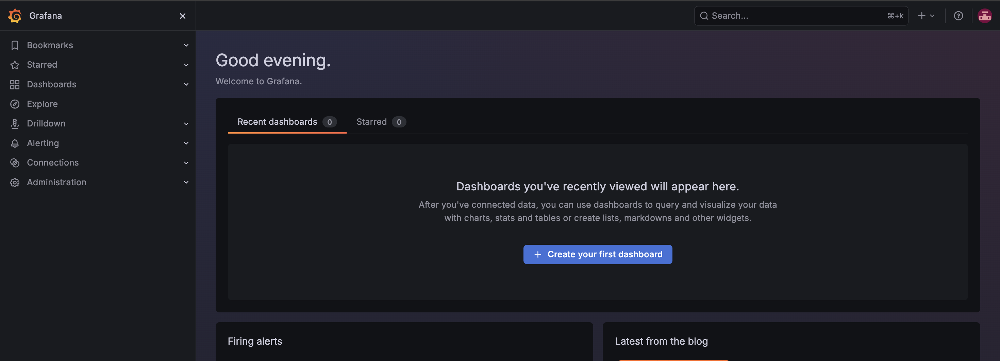

### 5. Настройка Grafana

#### Задание
1. Войти в Grafana
2. Добавить источник данных Prometheus
3. Создать дашборд

#### Выполнение
2. Перейдя во вкладку Connections -> Data Sources -> Add new data source был добавлен url prometheus
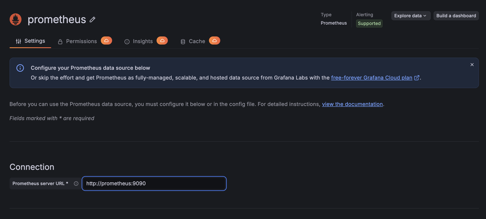
3. Создан новый дашборд "devops monitoring agadilova". Добавлена новая панель на дашборд с метрикой `node_cpu_seconds_total`
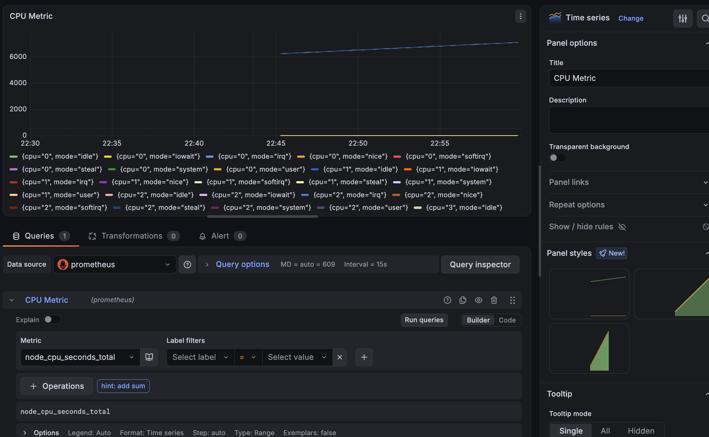

### 6. Тестирование системы

#### Задание
1. Проверить все контейнеры: `docker ps`
2. Открыть Prometheus и убедиться, что метрики собираются
3. Открыть Grafana и проверить отображение графиков
4. Создать несколько графиков для разных метрик (CPU, память, диск)

#### Выполнение
1. Контейнеры
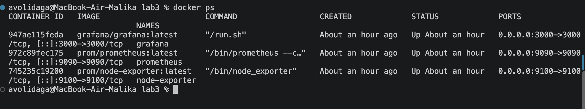
2. Метрики из Node Exporter видны в Prometheus
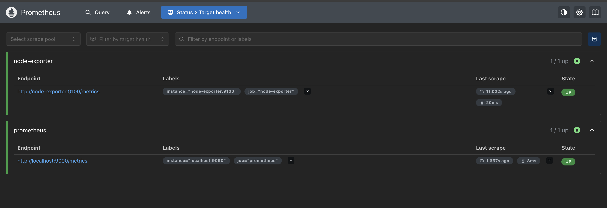
3. Графики успешно отображаются
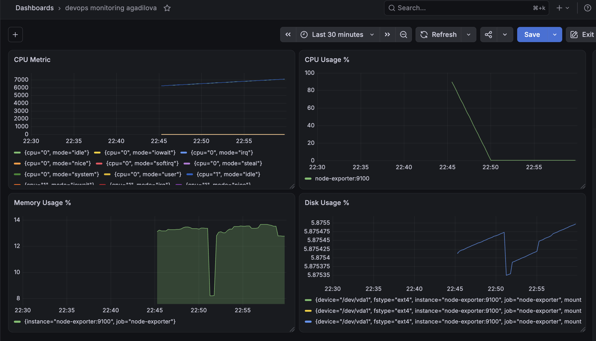
4. Для CPU, Memory, Disk добавила новые графики
    1. CPU Usage, %
    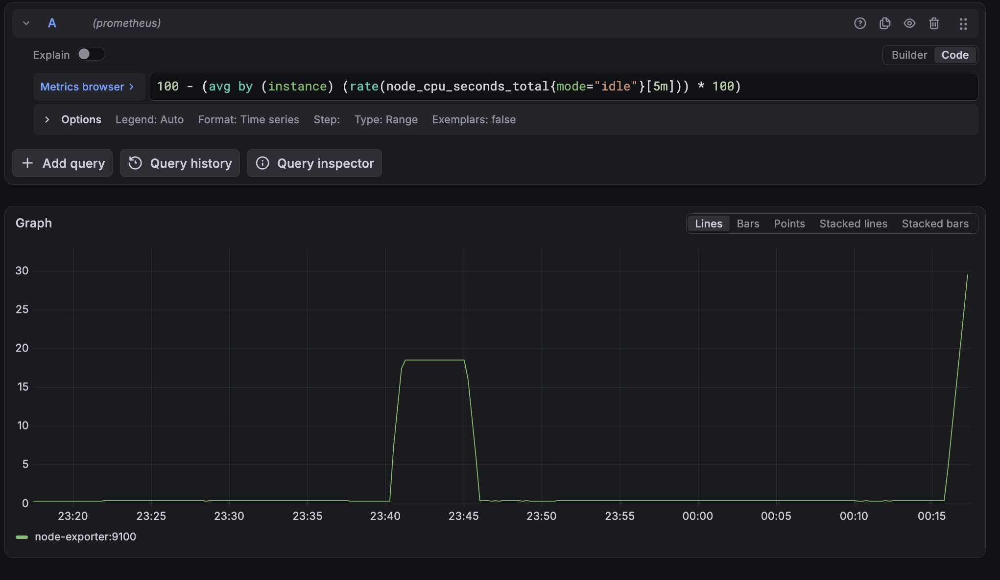
    2. Memory Usage, %
    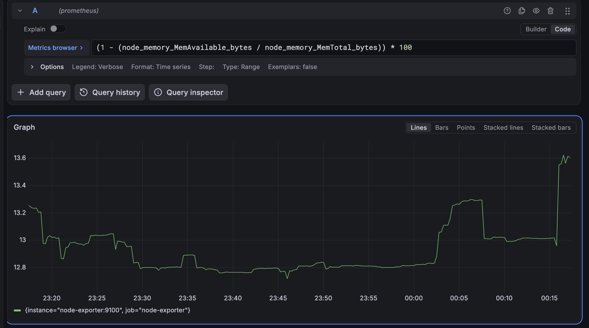
    3. Disk Usage, %
    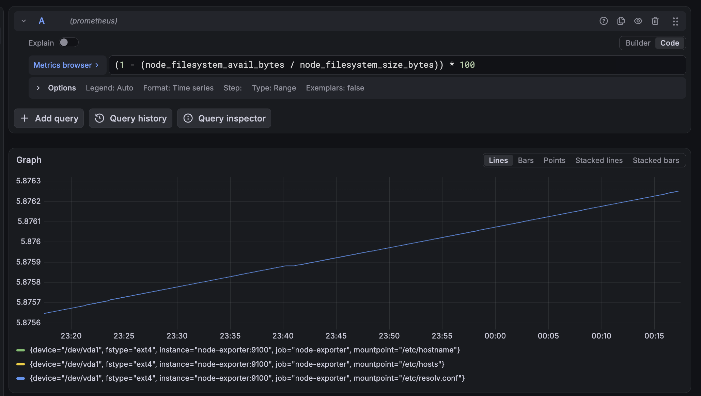


## Вывод

Таким образом, была реализована визуализация основных системных метрик, собранных Node Exporter и сохранённых Prometheus.